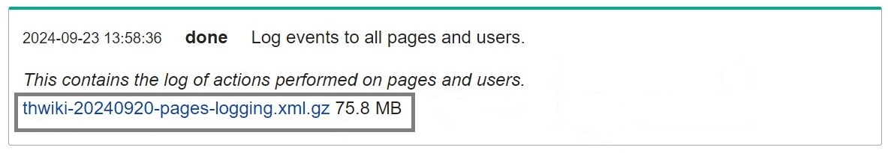

# Wikimedia Dump Challenge   

The demonstration of my work approach to ML model development using Wikipedia open data. The solution proposed in this challenge is the <b>"Machine Learning for detecting potential disruptive usages"</b> that might causes any damage to all human knowledge aviable on one of the most visited encyclopedia website; as of August 2024.

#### -- Project Status: [Completed]

# Table of Contents
 - [Project Contents](#1)
 - [Getting Started With This Project](#2)
 - [ML Problem Statement](#3)
    - [Problem Formulation](#3.1)
    - [Proposed Solution](#3.2)
    - [Data Scope](#3.3)
    - [Potential Users & Usages](#3.4)
 - [Work Approach](#4)
 - [Model Development Results](#5)
 - [Key Insights](#6)
 - [Further Improvement](#7)
 - [Contributor](#8)
 - [License](#9)


<a name='1'></a>

# Project Contents

```
ROOT
├── notebook                                  <- Notebooks for analysis and model development
│   ├── Exploratory Data Analysis.ipynb             <- Notebook for EDA
│   ├── Data Pre-Processing.ipynb                   <- Notebook for Data Processing
│   ├── Model Training.ipynb                        <- Notebook for Model Training
│   └── Post Model Development EDA.ipynb            <- Notebook for Post-Model Development EDA
├── .gitignore
├── LICENSE
├── README.md
└── requirements.txt                          <- requirement files for pip install
```

<a name='2'></a>

# Getting Started With This Project

To rerun all codes, Python environment (3.10.x) need to be set up properly with all the library specified in the requirement file. You can create the environment using native Python Virtual Environment (venv) or conda enviroment (recommended) using the below command at the project root
```
conda create -n <env_name> -f requirements.txt python=3.10    ## create the environment with requirement.txt
conda list                                                    ## list all imported packages
conda activate <env_name>                                     ## activate the environment
conda deactivate                                              ## deactivate the environment
```

Next, raw data is needed for the analysis and model development. The data file used here are including Log events to all users and Language proficiency information per user in [thwiki](https://dumps.wikimedia.org/thwiki/20240920/) dump. You can also refer to the correct file name to download in the below picture
- Log event

- Language Proficiency


After download the file, unzip all the files and move the file into <code>data/raw</code> folder (as shown below)
```
ROOT
├── data
│   └── raw
│        ├── thwiki-20240920-babel.sql 
│        └── thwiki-20240920-pages-logging.xml
├── notebook
....
```
> Note : file name must be exactly the same as mentioned above (if file names are different, please modify)

Finally, the execution order of each notebook should stricktly follow the given sequence
1. <b>Exploratory Data Analysis.ipynb</b> >> EDA on the data to come up with the solution proposal
2. <b>Data Pre-Processing.ipynb</b> >> All necessary data treatments for ML model development
3. <b>Model Training.ipynb</b> >> Iterative experiment on ML model algorithms and a set of model parameters
4. <b>Post Model Development EDA.ipynb</b> >> Analyze insights on model prediction behaviors and errors

<a name='3'></a>

# ML Problem Statement

<a name='3.1'></a>

## Problem Formulation

- Wikipedia, as one of the biggest online encyclopedia created and edited by volunteers around the world, is also a place for some users to enjoy their leisure time vandalizing human knowledge which have been constantly maintained from generation to generation.
<table>
<tr>
<th> Action count of banned users (>3 times) </th>
<th> Action count of regular users </th>
</tr>
<tr>
<td>


more vandalism : 'delete' action

</td>
<td>


more contribution : 'create' action

</td>
</tr>
</table>
- Despite all the threats to one of the biggest encyclopedia commulity, the process of user banning is still manual and sometimes might be considered as <b>inefficient, intolerable, and unproductive</b>.

<a name='3.2'></a>

## Proposed Solution

> Machine Learning for detecting potential “disruptive usages” from activity log

Develop a ML algorithm to detect disruptive usages from both current and historical usage log, where we define "disruptive usages" as <b>receiving >= 3 user blocks in the next 2 days</b>.

<a name='3.3'></a>

## Data Scope

 - Log event from all users (2017/01/01 - 2024/09/20) in [thwiki](https://dumps.wikimedia.org/thwiki/20240920/) dump
 - Language proficiency for each user (same dump)

 <a name='3.4'></a>

## Potential User and Usages
- Imaginary potential user : web admin / admin users
- solution usages :
   - For each log classified as "disruptive usages", automatically ban the user to prevent any further disruption
   - For new pattern of disruptions, incorporate new features representing those pattern to enhance model learning.


<a name='4'></a>

# Work Approach

- Conduct and Exploratory Data Analysis on the given data to come up with the proposed solution
- Pre-process raw data into the required format for further ML model development with a proper treatment
- Iterate over a set of ML algorithms, along with its parameters, to experiment on various algorithm settings and find the setting that best fit the data
- Analyze the behaviors of model prediction to elaborate on how model works in each scenario and guide a real-world usage to potential users.


<a name='5'></a>

# Model Development Results

|           Model          |       Accuracy     |      Precision    |       Recall      |         F1        |
|:------------------------:|:------------------:|:-----------------:|:-----------------:|:-----------------:|
| DT Classifier (baseline) |          0.95      |        0.59       |        0.99       |       0.74        |
|        DT Classifier     |          0.98      |        0.64       |        0.98       |       0.77        |
|<mark>Random Forest Classifier</mark>|          0.98      |  <i>0.65**</i>   |  <i>0.99**</i>   |       0.79        |
|XGBoost Classifier|          0.98      |<b><u>0.71</u></b>|        0.53       |       0.61        |


<a name='6'></a>

# Key Insights

## Feature Importance (Global SHAP)


- The most importance features are related to previous <b>user bans history</b> **\[1-2\]**
- The second-most importance features are related to <b>'delete’ action</b> **\[3, 5-6\]**


## Feature Value Impact on Prediction


- <b>Recent 'block' history</b> indicates a higher chance of disruptive behaviors **\[1-2\]**
- <b>High level of 'delete' activity</b> also indicates disruptive behaviors **\[3, 5-6, 8\]**
- <b>Semantic meaning of comments</b> also helps detecting destructive behaviors **\[7\]**

## Usage Recommendation : Prediciton Error

<u>Common error</u> found from prediction are associated with log information that
- Recently involved with <b>previous user bans</b>
- <b>Low level of 'delete' activities</b>, both current and previous
- <b>High average contribution</b> (more less than 5 times/day)


<a name='7'></a>

# Further Improvement
- Additional userful data source, such as User profile, Page edit history
- Solution improvement
    - Feature development including recent user 'unblock' history
    - Text processing on comment feature using Word Vectorizing, Word Embedding, etc.


<a name='8'></a>

# Contributor

:man: <b>Kunut Boonyasartpun</b> <br>
  &nbsp;&nbsp;&nbsp;&nbsp;&nbsp; Email: <a>kunut.boo@gmail.com</a> <br>
  &nbsp;&nbsp;&nbsp;&nbsp;&nbsp; GitHub: <a href="https://github.com/KunutBoon">@kunutboon</a> <br>


<a name='9'></a>

# License

[MIT License](https://opensource.org/license/mit/)